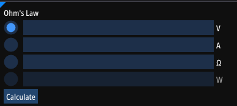
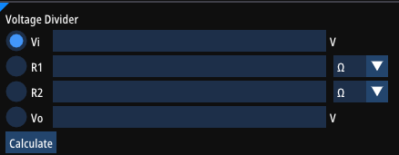
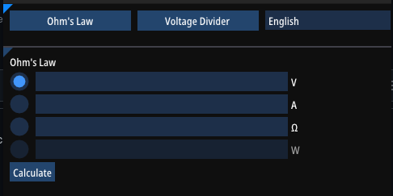

# Electronic Calculator
A perfect tool for anyone designing electronics. Replaces a piece of paper with modern software.

## Ohm's Law
If you need to quicly calculate voltage drop across a shunt, or see how much power a transistor dissipates, then this calculator is a tool for you.

## Voltage Divider
Perfect help in designing analog circuits. Designing simple amplifiers is easy with this calculator. Signal too big to feed into ADC? Calculater proper voltage divider values!

## Language Support
Currently 3 languages are fully supported:
- English
- Polish
- Russian

